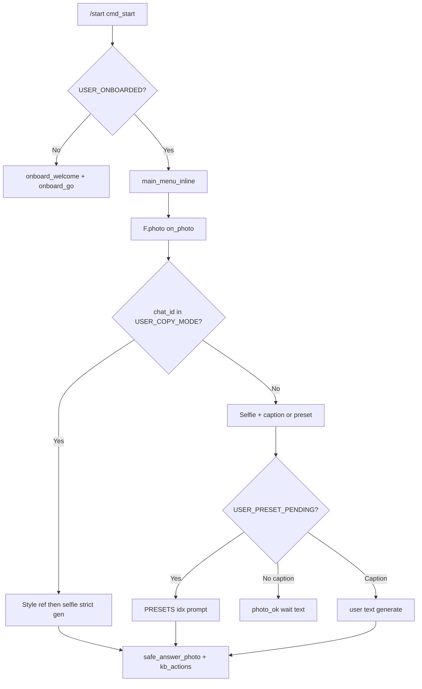
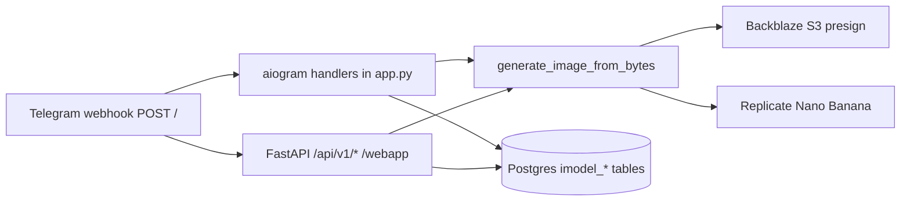

# 00 — Current State Audit

**Repository:** [vasilepiciriga-bot/imodel-bot](https://github.com/vasilepiciriga-bot/imodel-bot)  
**Branch audited:** `main` (reference commit family: durable jobs + mini app foundation)  
**App version string:** `iModel 2.7.0` (`APP_VERSION` in `app.py`)  
**Phase:** 0 — documentation only (no production code changes)

**Related docs:** [01 Million-Dollar Product Spec](./01_MILLION_DOLLAR_PRODUCT_SPEC.md) · [05 Implementation Phases](./05_IMPLEMENTATION_PHASES.md) · [07 Rollback Plan](./07_ROLLBACK_PLAN.md)

---

## 1. Executive summary

The production MVP is a **single monolith** in [`app.py`](../app.py) (~4,314 lines) that runs:

- **FastAPI** (`app` / `api` alias) for HTTP: Telegram webhook, health, embedded Mini App, REST API, admin, metrics
- **aiogram 3** (`bot`, `dp`) for Telegram bot commands, callbacks, photo/text flows, Stars payments
- **Optional Postgres** via `psycopg` when `DATABASE_URL` is set (`db_init()`, `DB_READY`)
- **S3-compatible storage** (Backblaze) for presigned URLs and optional JSON state mirror
- **Replicate** `google/nano-banana` (`NANOBANANA_MODEL`) for image generation
- **OpenAI** for GPT prompt refine and Vision scene analysis (Copy Mode)

**Product doctrine (target):** iModel is a premium Telegram-native AI photo studio—not a generic image generator. See [01](./01_MILLION_DOLLAR_PRODUCT_SPEC.md).

**Honest gaps:** No `/imodel` package, no Vite Mini App, no commercial prompt catalog wired to generation, no payment ledger, limited in-memory gallery, embedded HTML Mini App, `prompt_engine.py` not integrated.

---

## 2. Repository structure

| Path | Role | Future phase |
|------|------|--------------|
| [`app.py`](../app.py) | Entire runtime: bot + API + generation + admin | Extracted incrementally Phases 1–11 |
| [`boot.py`](../boot.py) | `uvicorn.run("app:api")` wrapper | Unchanged until optional entry split |
| [`config.py`](../config.py) | Legacy `WEBHOOK_URL` loader; **not** used by `app.py` (`WEBHOOK_BASE`) | Deprecate or align Phase 12 |
| [`prompt_engine.py`](../prompt_engine.py) | Standalone Vision JSON helper | Wire or remove Phase 1/7 |
| [`privacy.html`](../privacy.html) | Static privacy page | Serve/link Phase 11 |
| [`requirements.txt`](../requirements.txt) | Python deps | Extend per phase |
| [`Dockerfile`](../Dockerfile) | `uvicorn app:api --port 8080` | Add webapp build Phase 5 |
| [`Procfile`](../Procfile) | Same as Dockerfile CMD | Same |
| [`README.md`](../README.md) | Operator docs | Extend Phase 12 |
| [`.env.example`](../.env.example) | Env contract | Extend Phase 6+ |
| [`tests/test_security.py`](../tests/test_security.py) | Security regression baseline | Extend Phase 6+ |

**Not on `main` (out of scope unless explicitly chosen):** remote branch `origin/feat/v3-preview-first` (Go preview).

**Missing (planned):** `/docs/` (this set), `/imodel/`, `/webapp/`.

---

## 3. `app.py` responsibility map

| Concern | Primary symbols / routes | Lines (approx) |
|---------|--------------------------|----------------|
| Env & config | `BOT_TOKEN`, `WEBHOOK_BASE`, `WEBHOOK_SECRET`, `DATABASE_URL`, S3, `NANOBANANA_MODEL` | 65–661 |
| Postgres | `db_init`, `_db_*`, `imodel_*` tables | 169–278, 280–417 |
| Credits persistence | `USER_CREDITS`, `_credits_save`, `_credits_load`, `_db_save_credit` | 831–884, 353–363 |
| Jobs | `JOBS`, `record_job`, `job_event`, `_db_save_job`, `run_webapp_generation_job` | 703–801, 3738–3769 |
| Generation | `generate_image_from_bytes`, `replicate_generate`, `s3_put_and_presign` | 1440–2354 |
| Identity / scene locks | `IDENTITY_LOCK`, `NEGATIVE_LOCK`, `SCENE_LOCK`, `STRICT_NEGATIVE` | 1814–1840 |
| Presets | `Preset`, `PRESETS`, `kb_presets_grid`, `cb_preset_pick` | 926–991, 2993+ |
| Copy Mode | `USER_COPY_MODE`, `USER_COPY_STYLE`, `craft_mj_prompt_from_image`, `on_photo` copy branch | 897–900, 3226–3321 |
| i18n | `T`, `L`, `USER_LANG` | 993–1313 |
| Payments | `send_stars_invoice`, `got_payment`, `cb_buy_stars` | 2525–2604 |
| Bot handlers | `@dp.message`, `@dp.callback_query` | 2543–3550 |
| Webhook | `telegram_webhook`, `_process_telegram_update` | 3772–3810 |
| Mini App HTML | `webapp_index` | 3820–3930 |
| Mini App API | `api_webapp_session`, `api_me`, `api_gallery`, `api_create_generation`, `api_get_generation` | 3932–4033 |
| WebApp auth | `validate_webapp_init_data`, `make_webapp_token`, `webapp_user_from_request` | 3671–3736 |
| Admin / metrics | `http_metrics`, `admin_panel` | 4035–4314 |
| Startup | `on_startup`, `ensure_webhook` | 3594–3654 |

[`boot.py`](../boot.py) only starts uvicorn; production uses [`Dockerfile`](../Dockerfile) / [`Procfile`](../Procfile) → `uvicorn app:api`.

---

## 4. Telegram bot flow

**Entry commands (non-exhaustive):** `/start`, `/buy`, `/balance`, `/presets`, `/copy`, `/gallery`, `/refer`, `/promo`, `/pricing`, `/app`, `/help`, `/clear`, `/lang`, admin `/stats`, `/grant`, `/credits`.

**Main menu** (`main_menu_inline`): Buy, Balance, Presets, Copy, Help, Language, Referral, optional **Mini App** `WebAppInfo(url=WEBHOOK_BASE/webapp)`.

**Credit gate:** `has_credit` → `is_free_user` (whitelist `FREE_USERS` or `is_admin`) OR `USER_CREDITS[uid] > 0` (default `FREE_QUOTA`).

**Deduction:** After successful `generate_image_from_bytes` (not on failure)—see §9.

---

## 5. Webhook flow

| Step | Function | Contract |
|------|----------|----------|
| Receive | `@app.post("/")` `telegram_webhook` | Must return **fast** `{"ok": true}` |
| Auth | `_telegram_webhook_authorized` | `X-Telegram-Bot-Api-Secret-Token` == `WEBHOOK_SECRET`; optional query `secret` if `WEBHOOK_ALLOW_QUERY_SECRET=1` |
| Process | `BackgroundTasks` → `_process_telegram_update` → `dp.feed_update` | Async; errors logged, not blocking 200 |
| Register | `on_startup` → `ensure_webhook` | Sets Telegram webhook to `WEBHOOK_BASE` + `/` |

**Do not touch** until regression-tested: [06 QA](./06_QA_AND_LAUNCH_CHECKLIST.md) webhook section.

---

## 6. Generation flow

**Core function:** `generate_image_from_bytes(img_bytes, user_prompt, lang, strict, style_bytes, lock_scene, user_id, job_id)`

| Step | What happens |
|------|----------------|
| 1 | `record_job` / `job_event` — status `running` |
| 2 | `blocked(user_prompt)` — content filter |
| 3 | `craft_prompt_gpt` unless `strict` (Copy Mode skips rephrase) |
| 4 | Append `SCENE_LOCK` when `strict and lock_scene` |
| 5 | `s3_put_and_presign` input (`inputs/`) and optional style (`style/`) |
| 6 | `replicate_generate(NANOBANANA_MODEL, inputs)` — `image_input` single or `[style, selfie]` |
| 7 | Sensitive → `safer_variant` retry; non-strict → hard identity retry |
| 8 | `_download_with_retries` output URL |
| 9 | Reject if output MD5 == input MD5 (echo) |
| 10 | `record_job` status `generated`; return bytes |

**Mini App async path:** `api_create_generation` → `run_webapp_generation_job` → same `generate_image_from_bytes` → S3 `outputs/webapp/{job_id}_` → `status=ready`, deduct credit.

---

## 7. Copy Mode flow

| State | Variable | Purpose |
|-------|----------|---------|
| Active | `USER_COPY_MODE: Set[int]` | User in copy flow |
| Style ref | `USER_COPY_STYLE: Dict[int, bytes]` | Reference scene image |
| Manual scene text | `USER_COPY_PROMPT: Dict[int, str]` | Optional override |

**Sequence:** `/copy` or `copy_open` → first photo = style → `copy_style_ok` → second photo = selfie → `craft_mj_prompt_from_image` / `craft_scene_spec_from_image` → `generate_image_from_bytes(..., strict=True, style_bytes=..., lock_scene=True)` → 1 credit on success → clear copy state.

**Deep link:** `/start style_<token>` → `resolve_style_share` → preload style (in-memory `STYLE_SHARES`).

**Future:** Premium pricing (4 credits / 12 for set) in Phase 6–7; **must not break** strict multi-image path. See [03](./03_PROMPT_AND_TREND_ENGINE_SPEC.md).

---

## 8. Payments / Stars flow

| Function | Role |
|----------|------|
| `send_stars_invoice` | `currency="XTR"`, `provider_token=""` |
| `cb_buy_stars` | Maps `buy_stars_10/30/100` → payloads `pack_10/30/100`, stars 200/500/1200 |
| `process_pre_checkout_q` | Always approves |
| `got_payment` | `payload` → add 10/30/100 credits → `_credits_save()` → `notify_admins_payment` |

**No** `imodel_payments` table, **no** `telegram_charge_id` idempotency (duplicate risk). Phase 6: ledger + new payloads `starter_249`, etc. ([01](./01_MILLION_DOLLAR_PRODUCT_SPEC.md)).

---

## 9. Credits flow

| Mechanism | Location |
|-----------|----------|
| Balance | `USER_CREDITS: Dict[int, int]` |
| Default new user | `ensure_user_credit` → `FREE_QUOTA` (env, default 3) |
| Persist | `_credits_save` → `imodel_credits` + S3 `state/credits.json` |
| Spend | Decrement after successful generation (bot + webapp job) |
| Free | `FREE_USERS` set or `is_admin` |
| Promo | `PROMO_CODES`, `/promo` |
| Referral | `ref_*` deep link on `/start` — immediate bonuses `REF_BONUS_NEW` / `REF_BONUS_REF` |
| Admin grant | `/credits <uid> <delta>` with `credits.grant` |

**Failed generation:** Credits **not** deducted today (no refund table needed for failures). Phase 6+ may add explicit `refund` transactions if pre-hold is introduced.

---

## 10. Mini App current state

| Item | Today |
|------|--------|
| UI | Embedded HTML string in `webapp_index()` inside `app.py` |
| SDK | `telegram-web-app.js` CDN |
| Auth | `POST /api/v1/webapp/session` with `initData` |
| Session | Bearer token from `make_webapp_token` (7-day TTL) |
| Create | Free-text `prompt` + `image_b64` only — **no** style catalog |
| Poll | Client polls `GET /api/v1/generations/{job_id}` |
| Gallery API | Last 20 ready jobs for user from `JOBS` / `imodel_jobs` |

**Replacement:** React `/webapp` Phase 4–5 with `WEBAPP_V2_STATIC` fallback ([02](./02_PREMIUM_MINI_APP_SPEC.md)).

---

## 11. API endpoint inventory

| Method | Path | Auth | Handler |
|--------|------|------|---------|
| POST | `/` | `WEBHOOK_SECRET` header | `telegram_webhook` |
| GET | `/` | None | `root_health` |
| GET | `/healthz` | None | `healthz` |
| GET | `/webapp` | None | `webapp_index` (HTML) |
| POST | `/api/v1/webapp/session` | `initData` body | `api_webapp_session` |
| GET | `/api/v1/me` | Bearer / Init-Data | `api_me` |
| GET | `/api/v1/gallery` | Bearer | `api_gallery` |
| POST | `/api/v1/generations` | Bearer | `api_create_generation` |
| GET | `/api/v1/generations/{job_id}` | Bearer | `api_get_generation` |
| GET | `/metrics` | `?secret=METRICS_SECRET` | `http_metrics` |
| GET | `/admin` | `?secret=ADMIN_PANEL_SECRET` | `admin_panel` |

**Planned (Phase 3+):** `/api/v1/styles`, `/packs`, `/packages`, `/trends`, gallery delete, regenerate, upscale, style events.

---

## 12. Database table inventory

Created in `db_init()` when `DATABASE_URL` + `psycopg` available:

| Table | Purpose |
|-------|---------|
| `imodel_users` | uid, username, info_json, role, grants_json, timestamps |
| `imodel_credits` | uid, credits, updated_at |
| `imodel_stats_totals` | key, value counters |
| `imodel_stats_daily` | day, key, value |
| `imodel_jobs` | job_id, kind, status, chat_id, username, prompt, model, timeline_json, result_json, error, timestamps |
| `imodel_audit_log` | actor, action, target, data_json |

**Planned additive tables (Phase 2):** `imodel_payments`, `imodel_credit_transactions`, `imodel_styles`, `imodel_generation_results`, `imodel_style_events`. See [04](./04_ARCHITECTURE_REFACTOR_PLAN.md).

---

## 13. S3 / storage logic

| Function | Use |
|----------|-----|
| `s3_put_and_presign` | Generation inputs/outputs; presigned GET 3600s |
| `_s3_put_text` / `_s3_get_text` | Optional `STATE_PREFIX` JSON mirror (`credits.json`, stats) |
| Keys | `inputs/`, `style/`, `outputs/webapp/{job_id}_` |

**Env:** `S3_ENDPOINT`, `S3_REGION`, `S3_ACCESS_KEY_ID`, `S3_SECRET_ACCESS_KEY`, `S3_BUCKET`.

**Gallery bytes:** Not stored as durable gallery rows—only job `output_url` in `result_json` when webapp path succeeds.

---

## 14. Admin / metrics logic

| Surface | Access | Data source |
|---------|--------|-------------|
| `/metrics` | `METRICS_SECRET` query | In-memory `STATS`, job window from DB |
| `/admin` | `ADMIN_PANEL_SECRET` query | `STATS_USERS_INFO`, daily buckets, recent jobs |
| Telegram `/stats` | `is_admin` | Same counters |
| Roles | `USER_ROLES`, `ROLE_GRANTS`, `ADMIN_IDS`, `ADMIN_USERNAMES` | |
| Audit | `audit_log` → `imodel_audit_log` | |

---

## 15. Environment variables

Primary contract: [`.env.example`](../.env.example). Critical production vars:

| Variable | Used in | Notes |
|----------|---------|-------|
| `BOT_TOKEN` | `app.py`, WebApp HMAC | Required |
| `WEBHOOK_BASE` | Webhook URL, Mini App link | Public Railway URL |
| `WEBHOOK_SECRET` | Webhook auth, token signing salt | Required in prod |
| `WEBHOOK_ALLOW_QUERY_SECRET` | Legacy query auth | **Keep 0 in prod** |
| `REPLICATE_API_TOKEN` | Replicate | Required |
| `OPENAI_API_KEY` | GPT/Vision | Optional if `DISABLE_GPT_REFINE=1` |
| `DATABASE_URL` | Postgres | Recommended prod |
| `S3_*` | B2 / S3 | Required for generation URLs |
| `NANOBANANA_MODEL` | Replicate model id | Default `google/nano-banana` |
| `FREE_QUOTA` | New user credits | Default 3 |
| `ADMIN_IDS`, `ADMIN_USERNAMES` | Admin detection | |
| `METRICS_SECRET`, `ADMIN_PANEL_SECRET` | HTTP dashboards | |
| `PORT` | Railway | 8080 |

---

## 16. In-memory state dictionaries

| Name | Type | Risk on restart |
|------|------|-----------------|
| `USER_CREDITS` | Dict[int,int] | Reloaded from DB/S3 if configured |
| `USER_HISTORY` | Dict[int, List[bytes]] | **Lost**; max 5 images |
| `USER_COPY_MODE` / `USER_COPY_STYLE` | Set / Dict | Lost mid-flow |
| `JOBS` | Dict[str, dict] | Partial reload from `imodel_jobs` |
| `STYLE_SHARES` | Dict[token, entry] | **Lost** |
| `REF_MAP`, `REF_STATS` | Dict | **Lost** unless persisted elsewhere |
| `PRESETS` | List (static) | Safe (code) |
| `STATS`, `STATS_USERS_INFO` | counters / users | Partial persist via DB/S3 |

---

## 17. Security baseline (`tests/test_security.py`)

Automated checks (run: `python3 -m pytest -q`):

| Test | Asserts |
|------|---------|
| `test_telegram_webhook_requires_secret_header` | POST `/` without secret → 403; with header → 200 |
| `test_metrics_requires_secret` | `/metrics` gated |
| `test_admin_requires_secret` | `/admin` gated |
| `test_webapp_session_validates_init_data` | Bad initData → 403; valid → token |
| `test_webapp_me_requires_session_token` | Bearer required for `/api/v1/me` |
| `test_shutdown_does_not_delete_webhook` | Shutdown closes session only |

**Gap:** No tests for generation, payments, or Copy Mode.

---

## 18. Do-not-touch list

Until phase-specific QA passes:

1. `POST /` webhook + `WEBHOOK_SECRET` + background task pattern  
2. `got_payment` + payloads `pack_10`, `pack_30`, `pack_100`  
3. `generate_image_from_bytes` + Replicate + S3 presign contract  
4. Copy Mode: `USER_COPY_MODE`, strict path, `style_bytes` + `image_input` variants  
5. Mini App API routes: `/webapp`, `/api/v1/webapp/session`, `/me`, `/generations`, `/gallery`  
6. `/admin`, `/metrics` secret gates  
7. `Dockerfile` / `Procfile` → `uvicorn app:api` :8080  
8. `on_startup` → `ensure_webhook` (persistence on deploy)  
9. `IDENTITY_LOCK` / `SCENE_LOCK` semantics (extend, do not remove in Phase 7)

---

## 19. Known gaps (honest)

| Gap | Current | Target phase |
|-----|---------|--------------|
| Monolith | All logic in `app.py` | 1–11 extract per [04](./04_ARCHITECTURE_REFACTOR_PLAN.md) |
| Prompt product | `PRESETS` list only | 1 catalog, 7 `USE_PROMPT_BUILDER` |
| Mini App UI | Embedded HTML | 4–5 React + flag |
| Payments ledger | None | 6 `imodel_payments` |
| Gallery | `USER_HISTORY` ×5 in RAM | 8 `imodel_generation_results` |
| Premium packs | Only pack_10/30/100 | 6 new Star payloads |
| `/forget` | Mentioned in i18n, **no handler** | 11 privacy |
| `prompt_engine.py` | Not imported | 1 or 7 consolidate |
| Referral timing | On `/start` join | 11 first gen/purchase |
| Go v3 branch | Separate codebase | Out of scope |

---

## 20. Production Risk Map

| Risk area | Current location | Why risky | Future phase | Protection |
|-----------|------------------|-----------|--------------|------------|
| Webhook | `POST /` `telegram_webhook` | Production entry; must stay fast | All | Do not modify without [06](./06_QA_AND_LAUNCH_CHECKLIST.md); keep `WEBHOOK_SECRET` |
| Payment logic | `got_payment` | Duplicate `successful_payment` can double credits | Phase 6 | `imodel_payments` + `telegram_charge_id` unique |
| Generation | `generate_image_from_bytes` | Core revenue path | Phase 7 | Feature flag; Copy Mode regression first |
| Copy Mode | `USER_COPY_MODE` strict path | Premium differentiator | Phase 7 | Never break; test before prompt builder |
| Credits | `USER_CREDITS` + `_credits_save` | Desync memory/DB/S3 | Phase 2/6 | Ledger in `imodel_credit_transactions` |
| Gallery | `USER_HISTORY` | Lost on restart; limit 5 | Phase 8 | `imodel_generation_results` + S3 keys |
| Mini App | HTML in `webapp_index` | Hard to scale UX | Phase 4–5 | React build + `WEBAPP_V2_STATIC=0` fallback |
| Prompt system | `PRESETS` | No version/A/B/trends | Phase 1/7 | `imodel_styles` + `prompt_builder` |
| Jobs | `JOBS` + `imodel_jobs` | Partial durability | Phase 2/8 | Extend `result_json` / gallery rows |
| Deploy | `Dockerfile` uvicorn | Railway prod | All | `/healthz` + redeploy rollback [07](./07_ROLLBACK_PLAN.md) |
| Secrets | Env vars | Leak in logs/docs | All | Never commit; rotate if exposed |
| Admin | `/admin` HTML | Business decisions | Phase 10 | Keep old panel until parity |

---

## System diagram (current)

---

## Document contract (for future agents)

For any change, answer:

1. **What exists today?** — This doc §3–16  
2. **What must not be broken?** — §18  
3. **Exact symbols?** — §3 table + grep `app.py`  
4. **Future phase?** — [05](./05_IMPLEMENTATION_PHASES.md)  
5. **Safe migration?** — [04](./04_ARCHITECTURE_REFACTOR_PLAN.md)  
6. **Rollback?** — [07](./07_ROLLBACK_PLAN.md)
