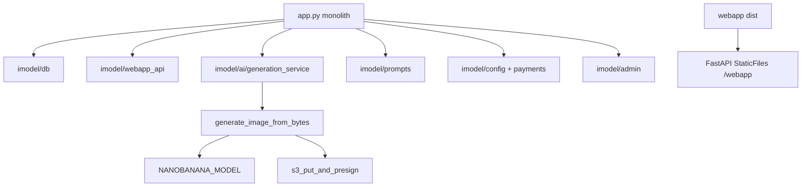

# 04 — Architecture Refactor Plan

**Status:** Phase 0 — safe incremental extraction contract  
**Monolith:** [`app.py`](../app.py) (~4,314 lines)  
**Audit:** [00](./00_CURRENT_STATE_AUDIT.md) · **Phases:** [05](./05_IMPLEMENTATION_PHASES.md) · **Rollback:** [07](./07_ROLLBACK_PLAN.md)

---

## 1. Current monolith summary

`app.py` exports:

- `app` / `api` — FastAPI  
- `bot`, `dp` — aiogram  
- All handlers, generation, payments, DB helpers, admin HTML  

**Entry:** [`Dockerfile`](../Dockerfile) → `uvicorn app:api --host 0.0.0.0 --port 8080`  
**Alt:** [`boot.py`](../boot.py) → same target  

---

## 2. Why no big-bang rewrite

| Risk | Big-bang | Incremental |
|------|----------|-------------|
| Webhook downtime | High | Low — same `POST /` |
| Stars payment regression | High | Legacy `got_payment` untouched until Phase 6 |
| Copy Mode break | Critical | Strict path tested each phase |
| Railway deploy | Failed healthz | Small diffs, rollback per [07](./07_ROLLBACK_PLAN.md) |

**Rule:** Extract modules; keep `app.py` as composition root until Phase 12 slim-down.

---

## 3. Future architecture

```
/imodel/
  config/
    packages.py       # Stars payloads: pack_10 + starter_249...
    styles.py         # re-export catalog
    settings.py       # env wrapper
  db/
    connection.py
    migrations.py     # additive CREATE IF NOT EXISTS
    users.py
    credits.py
    payments.py
    jobs.py
    styles.py
  bot/
    handlers_start.py
    handlers_photo.py
    handlers_payments.py
    handlers_admin.py
    keyboards.py
    texts.py          # million-dollar copy Phase 11
  ai/
    generation_service.py
    prompt_builder.py   # thin wrapper → imodel.prompts
    providers/
      replicate_provider.py
      openai_provider.py
      mock_provider.py
  webapp_api/
    session.py
    me.py
    styles.py
    pricing.py
    gallery.py
    generations.py
  admin/
    dashboard.py
    metrics.py

/webapp/               # Phase 4 — Vite React dist

app.py                 # Thin: include routers, register dp, startup
```

---

## 4. Extraction order

| Order | Module | Depends on | Phase |
|-------|--------|------------|-------|
| 1 | `imodel/prompts`, `trends`, `styles` | None | 1 |
| 2 | `imodel/db/migrations` | Postgres | 2 |
| 3 | `imodel/webapp_api/*` routers | db, prompts read | 3 |
| 4 | `webapp/` frontend | API 3 | 4 |
| 5 | Static mount + flag | webapp dist | 5 |
| 6 | `imodel/config/packages`, payments db | db 2 | 6 |
| 7 | `imodel/ai/generation_service` | prompts | 7 |
| 8 | Gallery service | db, S3 | 8 |
| 9 | Trends API + UI data | trends | 9 |
| 10 | `imodel/admin` | all metrics | 10 |
| 11 | `imodel/bot/texts`, growth | — | 11 |

---

## 5. Thin-wrapper integration pattern

**Phase 1–7 example:**

```python
# app.py (future) — pattern only, not Phase 0
from imodel.prompts.prompt_builder import build_prompt

def generate_image_from_bytes(..., style_key=None, ...):
    if os.getenv("USE_PROMPT_BUILDER") == "1" and style_key:
        built = build_prompt(style_key, user_prompt, ...)
        user_prompt = built["final_prompt"]
    # existing body unchanged below this line
```

**Handlers stay registered on same `dp`** until optional `imodel/bot` split (Phase 11).

**FastAPI:** `app.include_router(styles_router, prefix="/api/v1")` alongside existing routes—duplicate paths forbidden.

---

## 6. New database tables (additive only)

| Table | Phase | Purpose |
|-------|-------|---------|
| `imodel_payments` | 2 | Stars charges, idempotency |
| `imodel_credit_transactions` | 2 | Ledger: purchase, spend, refund, referral... |
| `imodel_styles` | 2 | Commercial catalog mirror |
| `imodel_generation_results` | 2/8 | Persistent gallery rows |
| `imodel_style_events` | 2/3 | viewed, selected, generated, ... |

**Migration rule:**

- `CREATE TABLE IF NOT EXISTS` only in early phases  
- **No** `DROP TABLE`  
- **No** destructive `ALTER` (column drops/renames)  
- Existing tables (`imodel_users`, `imodel_credits`, `imodel_jobs`, ...) remain compatible  

**Init today:** `db_init()` in `app.py` — extend same function or `imodel/db/migrations.py` called from `on_startup`.

---

## 7. Feature flags

| Flag | Default | Effect |
|------|---------|--------|
| `USE_PROMPT_BUILDER` | `0` | `build_prompt(style_key)` vs raw `PRESETS`/user text |
| `WEBAPP_V2_STATIC` | `0` | Serve `webapp/dist` vs embedded HTML |
| `NEW_STAR_PACKAGES` | `0` | Invoice payloads `starter_249` etc. |
| `PERSISTENT_GALLERY` | `0` | Write/read `imodel_generation_results` |
| `STYLE_CATALOG_V2` | `0` | API styles from DB vs static catalog |
| `PAYMENT_LEDGER_V2` | `0` | Write `imodel_payments` on `got_payment` |
| `COPY_MODE_V2` | `0` | Premium copy pricing (4 credits) |

Document each flag in `.env.example` when implemented (Phase 1+).

---

## 8. Non-goals

- Go rewrite (`feat/v3-preview-first`)  
- Deleting `app.py`  
- Removing legacy Stars payloads `pack_10`, `pack_30`, `pack_100`  
- Replacing Copy Mode before Phase 7 QA  
- Replacing embedded webapp without `WEBAPP_V2_STATIC=0` fallback  
- Training on user images without consent  

---

## 9. Risk controls

| Control | Mechanism |
|---------|-----------|
| Production entry | Webhook tests every phase [06](./06_QA_AND_LAUNCH_CHECKLIST.md) |
| Payment safety | Ledger + idempotency before enabling new payloads |
| Generation | `generation_service` wraps, does not fork Replicate logic |
| Deploy | `/healthz` + previous Railway image [07](./07_ROLLBACK_PLAN.md) |
| Secrets | Env only; never in docs |

---

## 10. Architecture diagram



---

## Safe migration per concern

| Concern | Today | Migration | Phase |
|---------|-------|-----------|-------|
| Webhook | `telegram_webhook` | No move; optional auth helper extract | 12 |
| Payments | `got_payment` | Call `payments.record()` behind flag | 6 |
| Credits | `USER_CREDITS` | Dual-write ledger | 6 |
| Generation | `generate_image_from_bytes` | Wrap with `generation_service` | 7 |
| Mini App routes | inline in `app.py` | Move to `webapp_api` routers | 3 |
| Admin | `admin_panel` | `imodel/admin/dashboard.py` | 10 |
| Presets UI | `cb_preset_pick` | Map index → `style_key` | 7 |

---

## Cross-links

- [03 Prompt spec](./03_PROMPT_AND_TREND_ENGINE_SPEC.md)  
- [02 Mini App spec](./02_PREMIUM_MINI_APP_SPEC.md)  
- [05 Phases](./05_IMPLEMENTATION_PHASES.md)
