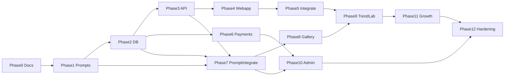

# 05 — Implementation Phases

**Status:** Master execution contract (Phase 0 → 12)  
**Current state:** [00 Current State Audit](./00_CURRENT_STATE_AUDIT.md)  
**Rollback:** [07 Rollback Plan](./07_ROLLBACK_PLAN.md)  
**Architecture:** [04 Architecture Refactor Plan](./04_ARCHITECTURE_REFACTOR_PLAN.md)

**Critical path:** Phase 0 → 1 → 2 → 3 → 4 → 5 **before** major bot copy overhaul. Phase 7 (prompt integration) **after** API + DB. Phase 8 (gallery) **before** full Trend Lab UI (Phase 9).

---

## Output format (every phase after 0)

1. What changed  
2. Files changed  
3. Why it matters  
4. How to test  
5. Risk  
6. Rollback → [07](./07_ROLLBACK_PLAN.md)  
7. Next step  

---

## Phase 0 — Audit documentation

| Field | Value |
|-------|-------|
| **Goal** | Project constitution in `/docs/` |
| **Files touched** | `docs/*.md` only |
| **Dependencies** | None |
| **Exit criteria** | 9 docs published; cross-linked; no `app.py` diff |
| **Risk** | None to production |
| **Owner** | All agents (read-first) |

---

## Phase 1 — Product config + prompt skeleton

| Field | Value |
|-------|-------|
| **Goal** | `imodel/prompts`, `trends`, `styles`, `config/packages.py` as **data/code** without wiring generation |
| **Files touched** | New `/imodel/**`; optional tests; `.env.example` flags documented |
| **Dependencies** | Phase 0 |
| **Exit criteria** | `build_prompt`, `score_prompt` unit tests pass; `app.py` behavior unchanged |
| **Risk** | Low if no imports in hot path |
| **Rollback** | [07](./07_ROLLBACK_PLAN.md) Phase 1 |
| **Owner** | Prompt & Trend Director |

**Do not:** Call `build_prompt` from `generate_image_from_bytes`.

---

## Phase 2 — Commercial DB layer

| Field | Value |
|-------|-------|
| **Goal** | Additive tables: `imodel_payments`, `imodel_credit_transactions`, `imodel_styles`, `imodel_generation_results`, `imodel_style_events` |
| **Files touched** | `imodel/db/migrations.py`; extend `db_init()` or call from startup |
| **Dependencies** | Phase 1 style seeds optional sync to `imodel_styles` |
| **Exit criteria** | Tables created on Railway Postgres; old tables untouched |
| **Risk** | Medium — migration errors on startup |
| **Rollback** | [07](./07_ROLLBACK_PLAN.md) Phase 2 |
| **Owner** | Backend Engineer |

---

## Phase 3 — API upgrade

| Field | Value |
|-------|-------|
| **Goal** | New routes: `/api/v1/styles`, `/styles/trending`, `/styles/{key}`, `/packs`, `/packages`, `/trends`, `/events/style`; keep existing 5 Mini App routes |
| **Files touched** | `imodel/webapp_api/*`; thin mounts in `app.py` |
| **Dependencies** | Phase 2 for DB-backed styles (or static catalog fallback) |
| **Exit criteria** | OpenAPI list; auth same as `webapp_user_from_request`; security tests still pass |
| **Risk** | Medium — route conflicts |
| **Rollback** | [07](./07_ROLLBACK_PLAN.md) Phase 3 |
| **Owner** | Backend Engineer |

---

## Phase 4 — Premium Mini App build

| Field | Value |
|-------|-------|
| **Goal** | Create `/webapp` Vite React TS Tailwind per [02](./02_PREMIUM_MINI_APP_SPEC.md) |
| **Files touched** | `webapp/**`; CI build script (optional) |
| **Dependencies** | Phase 3 APIs or mocks |
| **Exit criteria** | `npm run build` produces `dist/`; screens navigable in browser mock |
| **Risk** | Low to prod (not served yet) |
| **Rollback** | [07](./07_ROLLBACK_PLAN.md) Phase 4 |
| **Owner** | Mini App Design Engineer |

---

## Phase 5 — Mini App integration

| Field | Value |
|-------|-------|
| **Goal** | Serve `webapp/dist` when `WEBAPP_V2_STATIC=1`; keep `webapp_index()` fallback |
| **Files touched** | `app.py` static mount only (minimal); `Dockerfile` multi-stage optional |
| **Dependencies** | Phase 4 build |
| **Exit criteria** | [06](./06_QA_AND_LAUNCH_CHECKLIST.md) Mini App section pass in Telegram |
| **Risk** | Medium — UX regression |
| **Rollback** | `WEBAPP_V2_STATIC=0` |
| **Owner** | DevOps + Mini App |

**Rule:** Do not remove embedded HTML until parity verified.

---

## Phase 6 — Premium packages + payment logging

| Field | Value |
|-------|-------|
| **Goal** | Payloads `starter_249`, `creator_599`, `pro_999`, `max_1999`; ledger writes; idempotency on `telegram_charge_id` |
| **Files touched** | `imodel/config/packages.py`, `imodel/db/payments.py`, `got_payment`, `cb_buy_stars` |
| **Dependencies** | Phase 2 tables; `PAYMENT_LEDGER_V2` flag |
| **Exit criteria** | Legacy `pack_10/30/100` still work; duplicate payment ignored |
| **Risk** | **High** — revenue |
| **Rollback** | [07](./07_ROLLBACK_PLAN.md) Phase 6 |
| **Owner** | Payments Engineer |

---

## Phase 7 — Prompt builder integration

| Field | Value |
|-------|-------|
| **Goal** | `USE_PROMPT_BUILDER=1` routes `style_key` through `build_prompt` into `generate_image_from_bytes` |
| **Files touched** | `imodel/ai/generation_service.py`, `app.py` call sites, job metadata |
| **Dependencies** | Phase 1, 2, 3 |
| **Exit criteria** | Copy Mode strict path regression pass; preset index mapping works |
| **Risk** | **High** — output quality |
| **Rollback** | `USE_PROMPT_BUILDER=0` |
| **Owner** | AI Pipeline Engineer |

---

## Phase 8 — Persistent gallery

| Field | Value |
|-------|-------|
| **Goal** | Save results to `imodel_generation_results` + S3; gallery API 50 items; delete/regenerate/upscale stubs or impl |
| **Files touched** | `generation_service`, gallery routes, `cmd_gallery` |
| **Dependencies** | Phase 2, 3, 7 |
| **Exit criteria** | Restart survives gallery; `PERSISTENT_GALLERY=1` |
| **Risk** | Medium — storage cost |
| **Rollback** | `PERSISTENT_GALLERY=0` |
| **Owner** | Backend + AI Pipeline |

---

## Phase 9 — Trend Lab

| Field | Value |
|-------|-------|
| **Goal** | Trend Lab UI + `/api/v1/trends/weekly`; home sections from `is_trending` |
| **Files touched** | `webapp/pages/TrendLab.tsx`, trends API, `weekly_trends.md` process |
| **Dependencies** | Phase 3, 5, 8 recommended |
| **Exit criteria** | Trending carousel updates from catalog |
| **Risk** | Low |
| **Rollback** | [07](./07_ROLLBACK_PLAN.md) Phase 9 |
| **Owner** | Product + Mini App + Prompt |

---

## Phase 10 — Admin upgrade

| Field | Value |
|-------|-------|
| **Goal** | Business + prompt dashboards on `/admin`; style enable/disable |
| **Files touched** | `imodel/admin/dashboard.py` |
| **Dependencies** | Phase 2, 6, 7 |
| **Exit criteria** | Revenue + top styles visible |
| **Risk** | Low |
| **Rollback** | Old admin HTML path |
| **Owner** | Admin & Analytics Engineer |

---

## Phase 11 — Growth loops

| Field | Value |
|-------|-------|
| **Goal** | Share CTA, referral on first gen/purchase, trend broadcasts, comeback nudges, post-result upsells |
| **Files touched** | `imodel/bot/texts.py`, handlers, `NUDGE_ENABLED` content |
| **Dependencies** | Phase 5, 6, 8 |
| **Exit criteria** | Referral rules per [01](./01_MILLION_DOLLAR_PRODUCT_SPEC.md) |
| **Risk** | Medium — spam if nudges too aggressive |
| **Rollback** | Env disable flags |
| **Owner** | Product Director |

---

## Phase 12 — Production hardening

| Field | Value |
|-------|-------|
| **Goal** | QA complete, `docs/DEPLOYMENT.md`, `docs/ENVIRONMENT.md`, rate limits, monitoring |
| **Files touched** | Docs, tests, Dockerfile polish |
| **Dependencies** | All prior |
| **Exit criteria** | [06](./06_QA_AND_LAUNCH_CHECKLIST.md) all critical boxes checked |
| **Risk** | Low |
| **Rollback** | Railway previous deployment |
| **Owner** | QA + DevOps |

---

## Agent ownership matrix

| Agent | Primary docs | Phases |
|-------|--------------|--------|
| Product Director | 01, 05, 11 | 0, 9, 11 |
| Prompt & Trend Director | 03, TREND_OPERATIONS | 1, 7, 9 |
| Mini App Design Engineer | 02 | 4, 5, 9 |
| Backend Engineer | 04, 00 | 2, 3, 8 |
| AI Pipeline Engineer | 03, 04 | 7, 8 |
| Payments Engineer | 01, 04 | 6 |
| Admin & Analytics | 01 | 10 |
| QA Engineer | 06 | 12 |
| DevOps Engineer | 04, 06, 07 | 5, 12 |

---

## Phase dependency diagram

---

## Recommended Phase 1 starting point (after Phase 0)

1. Create `imodel/prompts/prompt_builder.py` + `base_identity.py` + `negative_prompts.py`  
2. Seed `imodel/trends/trend_catalog.py` with First 30 keys from [03](./03_PROMPT_AND_TREND_ENGINE_SPEC.md)  
3. Add `imodel/config/packages.py` with **both** legacy and future package definitions (no handler wire)  
4. Unit tests for `build_prompt` / `score_prompt`  
5. Document `USE_PROMPT_BUILDER=0` in `.env.example`  

**Do not** modify `got_payment` or `generate_image_from_bytes` in Phase 1.
